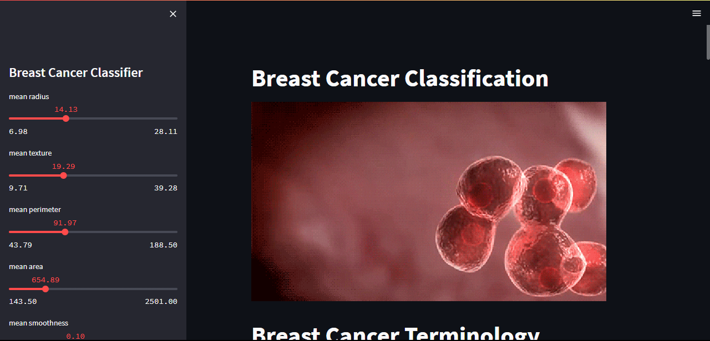
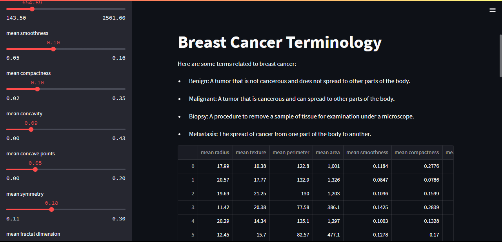
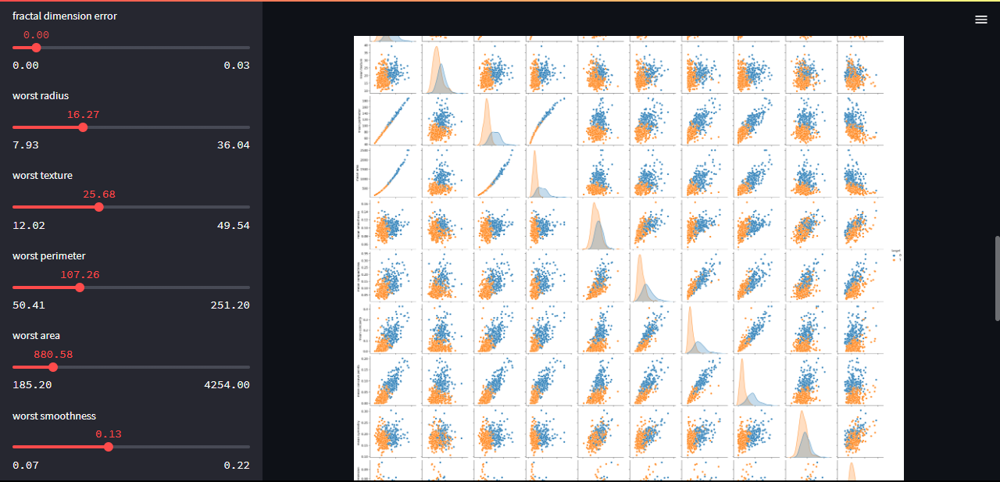

# 🧠 Breast Cancer Classification Web App using Streamlit

A machine learning-powered web application that classifies breast tumors as **benign** or **malignant** using user-selected features. Built with **Python**, **Scikit-learn**, and **Streamlit**, the app makes data science accessible through a simple and interactive interface.

---

## 💡 Overview

This web app allows users to explore the Breast Cancer dataset, select relevant features, and generate predictions using a **Random Forest Classifier**. It provides:
- ✅ Real-time classification results  
- 📊 Confusion matrix and accuracy score  
- 🎛️ Interactive feature selection sidebar  

---

## ⚙️ Technologies Used

- 🐍 Python  
- 📘 Scikit-learn  
- 📊 Pandas & Seaborn  
- 🌐 Streamlit  

---

## 🌍 Social Impact

Early detection of breast cancer can save lives. This project shows how **machine learning can empower healthcare solutions**, especially for scalable diagnostics in remote or under-resourced areas. By making predictive tools interactive and visual, we can:
- Enhance awareness and education  
- Support healthcare professionals in early decision-making  
- Encourage exploration of real-world medical datasets  

---

## 🖼️ Screenshots

### 📌 App Interface  

### 📌 Terminology

### 📌 Classification Output  

---

## 👨‍💻 Author

**Tanmay Arya**  
🎓 Duke University – MQM '26  
📊 Passionate about Data Analytics, ML, and Social Impact  
